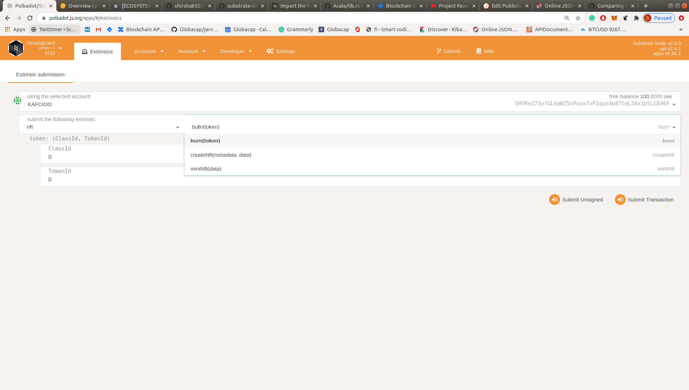
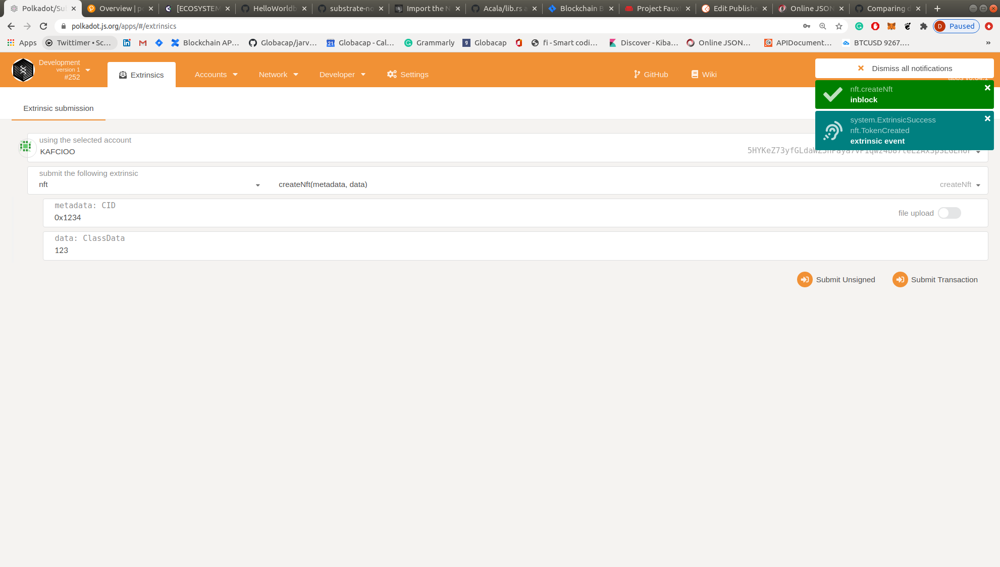

* Compile node - sudo WASM_BUILD_TOOLCHAIN=nightly-2020-10-05 cargo build --release  
* start node ./target/release/node-template --dev
* open https://polkadot.js.org/apps/#/extrinsics and start creating nfts !

### Interface

### Create nft

